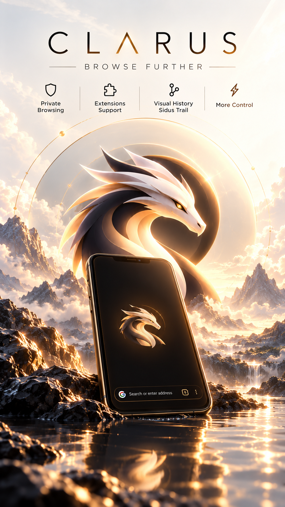
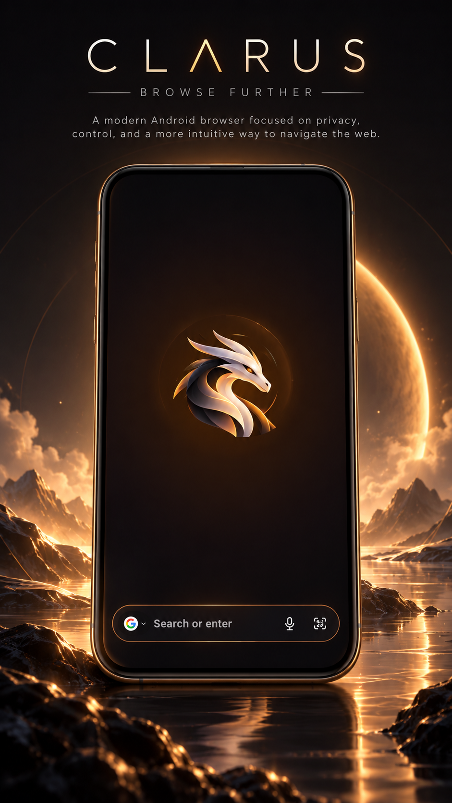
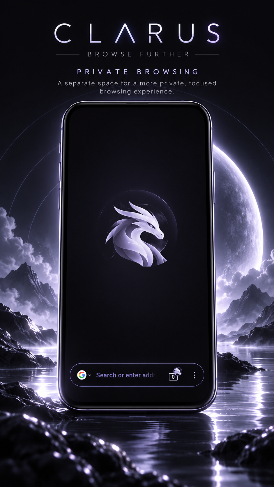
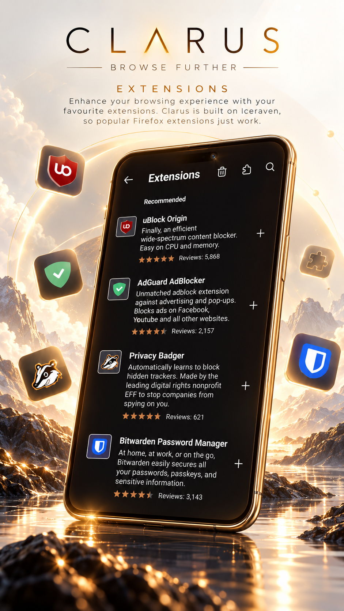
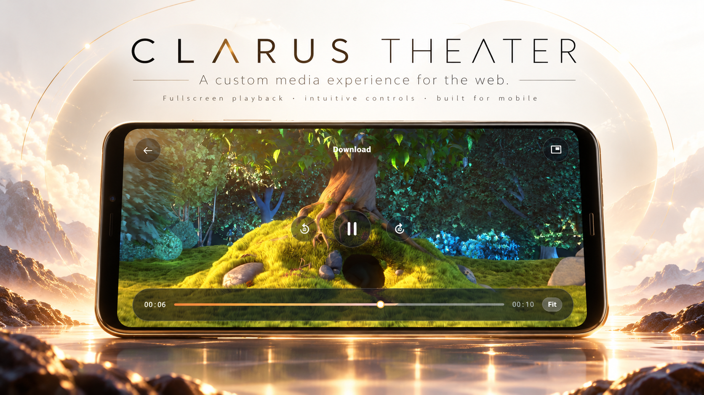
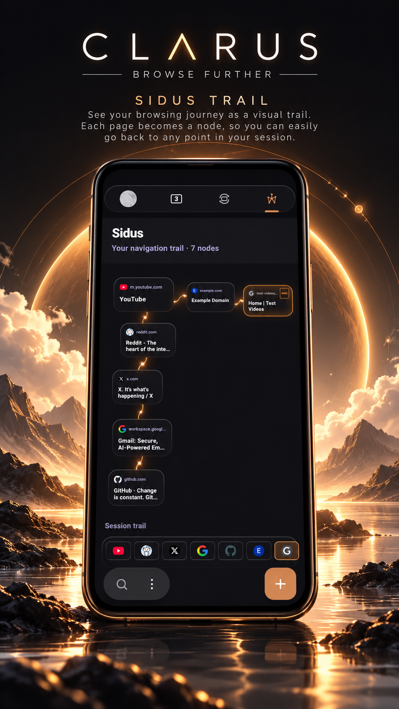

# Clarus Browser 🐉

A Firefox-engine browser for Android with a dragon, a glassy tab tray, and a few tricks up its sleeve.

> **Beta.** It works, I use it, and it has rough edges. See [Known issues](#known-issues) before you get attached.

<p align="center">
  <a href="https://vimeo.com/1233824379?share=copy&fl=sv&fe=ci">
    
  </a>
</p>

<p align="center">
  <a href="https://vimeo.com/1233824379?share=copy&fl=sv&fe=ci"><strong>▶ Watch the Clarus showcase on Vimeo</strong></a>
</p>

## Showcase

### Home

<p align="center">
  
</p>

A clean, focused starting point with the dragon at the center and a minimal search bar at the bottom.

### Private Browsing

<p align="center">
  
</p>

A separate private browsing space with its own visual identity and a cool violet treatment.

### Extensions

<p align="center">
  
</p>

Install and manage compatible browser extensions directly from Clarus, including content blockers, privacy tools, and password managers.

### Clarus Theater

<p align="center">
  
</p>

A dedicated media experience for audio and video, with fullscreen playback and controls designed around mobile use.

### Sidus Trail

<p align="center">
  
</p>

A visual map of your browsing journey. Each tab gets its own branch, with pages represented as connected nodes that you can tap to jump back through your session.

## What's in the box

- **Hold to Peek.** Press and hold a link to get a live preview without leaving your page. Then, without letting go, use gestures:
  - Swipe **up** to open the link in a new tab.
  - Swipe **left** to open it in a private tab.
  - Swipe **down** to reveal the available actions, then release over the one you want.
  - The actions adapt to what you're holding. On a direct audio link, "New Tab" becomes "Download".
- **Sidus Trail.** Your browsing history as a map. Each tab gets its own branch, and every page you visit becomes a node in a connected trail. You can see where you started and how you got where you are, and tap any earlier page to jump straight back to it. The trail starts as a blank canvas each new browser session.
- **Glass tab tray.** Your tabs, but frosted and a bit nicer to look at.
- **Clarus Theater.** A built-in player for audio and video, so media gets its own space instead of fighting the page.
- **Haptics.** Little taps where they feel right.
- **Dragon branding.** Orange, dark, and a bit dramatic.
- **A lighter app.** No sign-in, no sync, no VPN. Those were removed on purpose.

## Install

1. Go to the [Releases page](https://github.com/AvGDeV-io/Clarus/releases) and grab the APK. Right now only **arm64-v8a** (most modern phones) has been tested.
2. Check the SHA-256 listed in the release notes against your download.
3. Open the APK. Android will grumble about installing from "unknown sources". You'll need to allow it for whichever app you opened the file with. That's normal for apps outside the Play Store.
4. Open Clarus and you're in.

## Privacy, honestly

Here's what I actually checked, not what sounds nice:

- Telemetry upload is **off**. As far as my audit found, nothing is sent to Mozilla for analytics.
- Crash reporting defaults to **Never**.
- On first launch the browser makes one request to Mozilla's Remote Settings service. That service delivers things like certificate revocation data and blocklists, so I left it on because turning it off would make the browser less safe.
- Normal browsing traffic (the sites you visit, search, safe browsing) goes where you'd expect.

The longer version lives in [PRIVACY.md](PRIVACY.md). If you catch Clarus doing something this section doesn't mention, please open an issue. I'd rather know.

## Known issues

It's a beta, so here's the honest list:

- Theater's fullscreen doesn't trigger on some embedded videos.
- Crash reports aren't collected, so if something breaks, tell me what you were doing (a screenshot helps a lot).
- Only the arm64 build has been tested.
- Building from source needs Python installed. The setup script is Windows-only for now, and Linux/Mac get written instructions instead.

## Build it yourself

You don't need `--recursive`. Everything, including `android-components`, lives in this repo.

```
git clone https://github.com/AvGDeV-io/Clarus.git
cd Clarus
```

Then:

1. Install the Android SDK and a recent JDK, and make sure Python 3 is on your PATH.
2. On Windows, run `setup.ps1` once. It creates the Python environment the build needs. On Linux or Mac, follow the same steps by hand (see the comments in `setup.ps1`).
3. Build a debug APK:

```
./gradlew assembleForkDebug
```

Release builds need your own signing key. Don't commit it. `keystore.properties` and `*.jks` are gitignored for a reason.

<!-- TODO: confirm these steps match setup.ps1 before publishing -->

## Found a bug?

[Open an issue](https://github.com/AvGDeV-io/Clarus/issues). Useful things to include: your phone model, Android version, what you tapped, and what you expected to happen. Screenshots welcome.

## Standing on big shoulders

Clarus wouldn't exist without:

- **Mozilla**, for Firefox for Android (Fenix), GeckoView, and Android Components.
- **[Iceraven Browser](https://github.com/fork-maintainers/iceraven-browser)**, the fork Clarus is built on.
- **[akliuxingyuan/android-components](https://github.com/akliuxingyuan/android-components)**, Iceraven's Android Components fork. The vendored copy in this repo starts from commit `56ef46b`.

Thank you to everyone who worked on those. The good parts are theirs. The bugs are probably mine.

## Not affiliated with Mozilla

Clarus is an independent project. It is not made, endorsed, vetted, or secured by Mozilla. Firefox and Mozilla are trademarks of the Mozilla Foundation.

## License

Clarus is released under the [Mozilla Public License 2.0](LICENSE). Original copyright notices and license headers from Mozilla and Iceraven are kept in the source files. If you modify and distribute it, MPL 2.0 asks you to share your changes to those files too.
